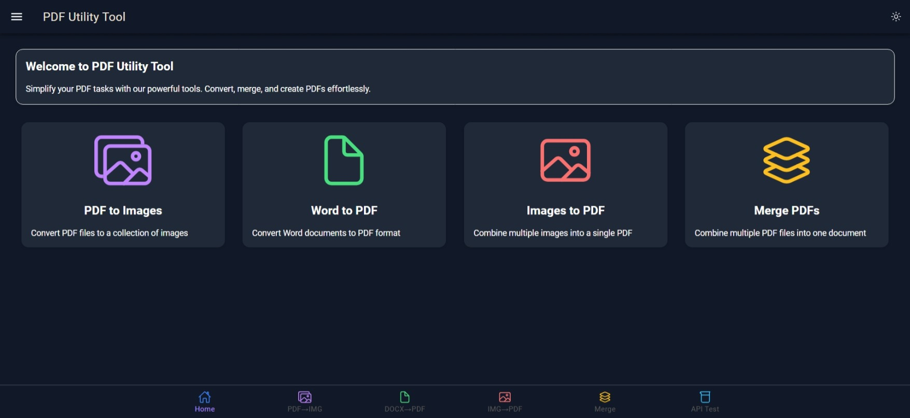

# PDF Utility Tool - Frontend

A modern, responsive web application built with Ionic React for performing various PDF operations including converting images to PDF, extracting images from PDFs, converting Word documents to PDF, and merging multiple PDF files.



## Features

- **PDF to Images**: Convert PDF documents to high-quality JPG images
- **Word to PDF**: Transform Word documents (.doc, .docx) into PDF format
- **Images to PDF**: Combine multiple images (JPG, PNG) into a single PDF document
- **Merge PDFs**: Combine multiple PDF files into a single document
- **Test API**: Test backend API endpoints for troubleshooting
- **Dark Mode Support**: Toggle between light and dark themes
- **Responsive Design**: Works on desktop, tablet, and mobile devices
- **Real-time Progress Tracking**: Visual progress bars for all operations
- **Drag and Drop**: Intuitive file uploading via drag and drop
- **File Management**: Add, remove, and reorder files before processing
- **Consistent UI Design**: Color-coded interface with intuitive navigation

## Tech Stack

- **Frontend Framework**: Ionic React
- **Build Tool**: Vite
- **UI Framework**: TailwindCSS
- **Icons**: Ionicons
- **Mobile Support**: Capacitor for native mobile deployment

## Getting Started

### Prerequisites

- Node.js (v16.0.0 or later)
- npm (v7.0.0 or later)
- Backend server running (see backend documentation)

### Installation

1. Clone the repository:
   ```bash
   git clone [repository-url]
   cd pdf-utility-backend/frontend
   ```

2. Install dependencies:
   ```bash
   npm install
   ```

3. Start the development server:
   ```bash
   npm run dev
   ```

4. Build for production:
   ```bash
   npm run build
   ```

5. For mobile development with Capacitor:
   ```bash
   npm run build
   npx cap sync
   npx cap open android  # For Android
   npx cap open ios      # For iOS
   ```

## Application Structure

```
frontend/
├── public/            # Static assets
├── src/
│   ├── assets/        # Images and other assets
│   ├── components/    # Reusable UI components
│   ├── pages/         # Application pages
│   │   ├── Home.jsx               # Landing page
│   │   ├── About.jsx              # About page
│   │   ├── ImagesToPdf.jsx        # Images to PDF conversion
│   │   ├── PdfToImages.jsx        # PDF to images conversion
│   │   ├── WordToPdf.jsx          # Word to PDF conversion
│   │   ├── MergePdfs.jsx          # PDF merging functionality
│   │   └── TestApi.jsx            # API testing interface
│   ├── theme/         # Theme variables and styles
│   ├── App.jsx        # Main application component
│   └── main.jsx       # Application entry point
└── capacitor/         # Mobile platform specific code
```

## Key Components

### Home Page
The landing page displays color-coded cards for each conversion operation:
- Purple: PDF to Images
- Green: Word to PDF
- Red: Images to PDF
- Amber: Merge PDFs

### File Upload
All conversion pages feature:
- Drag and drop zone for file uploads
- File selection button
- File list with reordering capability
- File size display

### Progress Tracking
The application provides real-time feedback during conversion operations:
- Progress percentage display
- Status text (e.g., "Uploading files...", "Processing...")
- Animated progress bar
- Operation-specific messaging

## Usage Guide

### PDF to Images Conversion
1. Navigate to the "PDF to Images" section
2. Upload one or more PDF files using drag & drop or file picker
3. Click the "Convert" button
4. Monitor progress through the progress bar
5. Download the resulting ZIP file containing JPG images

### Word to PDF Conversion
1. Navigate to the "Word to PDF" section
2. Upload one or more Word documents (.doc, .docx)
3. Click the "Convert" button
4. Monitor upload and conversion progress
5. Download the converted PDF file(s)

### Images to PDF Conversion
1. Navigate to the "Images to PDF" section
2. Upload JPG/PNG images
3. Reorder images if needed using drag handles
4. Click the "Convert" button
5. Track conversion progress in real-time
6. Download the generated PDF

### Merge PDFs
1. Navigate to the "Merge PDFs" section
2. Upload two or more PDF files
3. Arrange files in the desired order
4. Click the "Merge" button
5. Monitor the merging process via progress bar
6. Download the combined PDF

## Configuration

The application connects to a backend server for processing. By default, it uses:
- Backend URL: http://localhost:5000

You can configure the backend connection in the first run dialog or modify the `backendEndpoint` variable in the respective component files.

## Technical Implementation Notes

### XMLHttpRequest for Progress Tracking
The application uses custom `fetchWithProgress` functions in each conversion component to track real-time progress:
- Upload progress monitoring
- Processing status updates
- Error handling with specific error messages

### Responsive Design
- Adaptive layout for mobile, tablet, and desktop
- Tailwind CSS utility classes
- Ionic components with custom styling

## Contributing

1. Fork the repository
2. Create your feature branch: `git checkout -b feature/amazing-feature`
3. Commit your changes: `git commit -m 'Add some amazing feature'`
4. Push to the branch: `git push origin feature/amazing-feature`
5. Open a Pull Request

## License

This project is licensed under the MIT License - see the LICENSE file for details.

## Acknowledgments

- Ionic Framework for the UI components
- TailwindCSS for styling
- Vite for fast development and building
- The Python backend for processing operations
